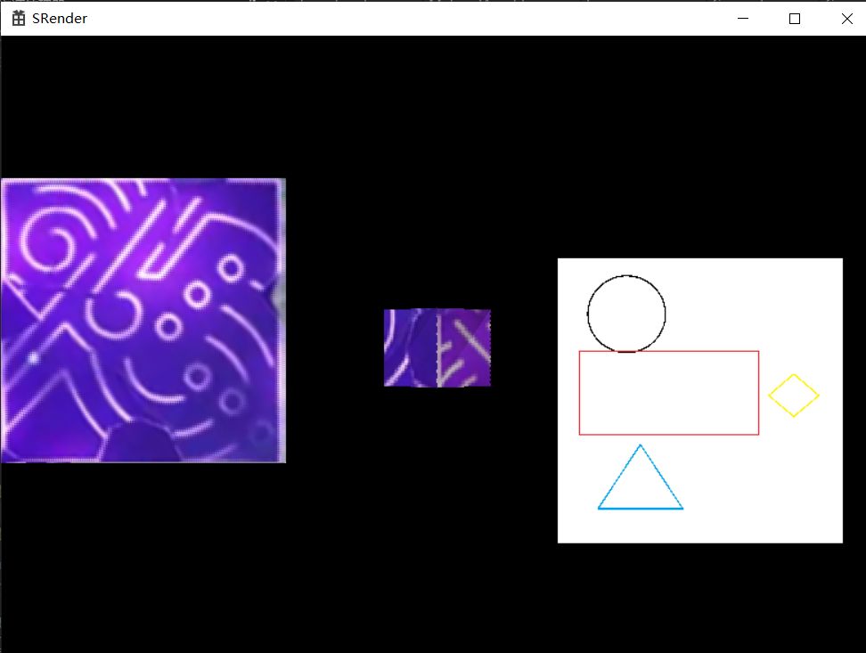

# SGENGINE - A Simple 3D Game Engine

## Introduction

Simple Game Engine is a 3D Game Engine written in C++. More functions are coming soon. Please be patient and wait.

Because SGEngine has adopted a "Scene-Object-Component" structure similar to Unity, it is easy for you to manage Game Objects and Components in a Scene, you can also write your own components.

If you have Unity, Cocos, Unreal, or other engine foundations, then the following content will be easy for you to understand.


## Update Log

- 2023/7/16 Version 2.0

&emsp;&emsp;Features：

1. Abandon OpenGL and use my own simple renderer (which is named SRender)  instead  (note: SRenderer only supports the Windows platform), and implemented camera components and some UI components based on SRenderer.
2. A resource manager to facilitate the management of loaded images or model assets.
3. Implemented ObjLoader and BmpLoader to load simple .obj and .bmp files。
4. The matrix class has been re-implemented, and the original matrix class EngineTools:: Matrix has been deprecated. Please use SRender:: MathTools:: Matrix.
5. Change the base type of EngineTools:: Vector3 from float to double.


- 2023/6/13 Version 1.0

&emsp;&emsp;Features:

1. Basic Engine Structure.
2. Render with OpenGL.
3. An animation controller to control simple animations.


## Thanks

- Thanks for ZhiHu User - Ekennis [https://www.zhihu.com/people/eykenis/posts](https://www.zhihu.com/people/eykenis/posts)，Most of the knowledge about triangles in SRender is referenced from these articles. At the same time, the rendering pipeline also refers to these articles, but there are some changes according to the actual data structure.

- Thanks for the CSDN Blogger Jaihk662, his article [https://blog.csdn.net/jaihk662/category_9903113_2.html](https://blog.csdn.net/jaihk662/category_9903113_2.html)  taught me a lot about OpenGL and how to configure OpenGL environment.  In Version 1.0, there are also some files in the engine source code that are directly referenced from the code in the articles, such as Camera.h, Shader.h, Model.h, Mesh.h and the default shader source code of Render Module. In Version 2.0, the phong shader source is rewritten to C++based on his GLSL code. Here are the GLSL codes:

  ObjVShader.vert

  ```glsl
  #version 330 core
  layout (location = 0) in vec3 position;
  layout (location = 1) in vec3 normal;
  layout (location = 2) in vec2 texture;
  out vec2 texIn;
  out vec3 normalIn;
  out vec3 fragPosIn;
  uniform mat4 model;             //模型矩阵
  uniform mat4 view;              //观察矩阵
  uniform mat4 projection;        //投影矩阵
  void main()
  {
      gl_Position = projection * view * model * vec4(position, 1.0);
      texIn = texture;
      fragPosIn = vec3(model * vec4(position, 1.0f));
      normalIn = mat3(transpose(inverse(model))) * normal;
  }
  
  ```

  ObjFShader.frag

  ```glsl
  #version 330 core
  struct Material
  {
      sampler2D texture_diffuse1;      //贴图
      sampler2D texture_specular1;     //镜面贴图
      sampler2D emission;     //放射贴图
      float shininess;        //反光度
  };
  struct SunLight             //平行光
  {
      vec3 direction;
      vec3 diffuse;
      vec3 specular;
  };
  struct PointLight           //点光源
  {
      vec3 position;
      vec3 diffuse;
      vec3 specular;
      float k0, k1, k2;
  };
  struct SpotLight            //聚光灯
  {
      vec3 position;
      vec3 direction;
      vec3 diffuse;
      vec3 specular;
      float k0, k1, k2;
      float cutOff, outCutOff;
  };
  uniform vec3 ambient;
  uniform Material material;
  uniform SunLight sunLight;
  uniform PointLight pointLights[3];
  uniform SpotLight spotLight;
  vec3 CalcSunLight(SunLight light, vec3 normal, vec3 viewDir);
  vec3 CalcPointLight(PointLight light, vec3 normal, vec3 fragPos, vec3 viewDir);
  vec3 CalcSpotLight(SpotLight light, vec3 normal, vec3 fragPos, vec3 viewDir);
  out vec4 color;
  uniform vec3 viewPos;
  in vec2 texIn;
  in vec3 fragPosIn;
  in vec3 normalIn;
  void main()
  {
      //环境光
      vec3 ambient = ambient * vec3(texture(material.texture_diffuse1, texIn));
      vec3 viewDir = normalize(viewPos - fragPosIn);
      vec3 normal = normalize(normalIn);
      vec3 result = CalcSunLight(sunLight, normal, viewDir);
      for (int i = 0; i <= 2; i++)
          result = result + CalcPointLight(pointLights[i], normal, fragPosIn, viewDir);
      result = result + CalcSpotLight(spotLight, normal, fragPosIn, viewDir);
      color = vec4(result, 1.0f);
  }
   
  vec3 CalcSunLight(SunLight light, vec3 normal, vec3 viewDir)
  {
      vec3 lightDir = normalize(-light.direction);
      float diff = max(dot(normal, lightDir), 0.0f);
      vec3 diffuse = light.diffuse * (diff * vec3(texture(material.texture_diffuse1, texIn)));
   
      vec3 reflectDir = reflect(-lightDir, normal);
      float spec = pow(max(dot(viewDir, reflectDir), 0.0), material.shininess);
      vec3 specular = light.specular * (spec * vec3(texture(material.texture_specular1, texIn)));
   
      return diffuse + specular;
  }
   
  vec3 CalcPointLight(PointLight light, vec3 normal, vec3 fragPos, vec3 viewDir)
  {
      vec3 lightDir = normalize(light.position - fragPos);
      float diff = max(dot(normal, lightDir), 0.0f);
      vec3 diffuse = light.diffuse * (diff * vec3(texture(material.texture_diffuse1, texIn)));
   
      vec3 reflectDir = reflect(-lightDir, normal);
      float spec = pow(max(dot(viewDir, reflectDir), 0.0), material.shininess);
      vec3 specular = light.specular * (spec * vec3(texture(material.texture_specular1, texIn)));
   
      float dis = length(light.position - fragPos);
      float attenuation = 1.0f / (light.k0 + light.k1 * dis + light.k2 * (dis * dis));
   
      diffuse *= attenuation;
      specular *= attenuation;
      return diffuse + specular;
  }
   
  vec3 CalcSpotLight(SpotLight light, vec3 normal, vec3 fragPos, vec3 viewDir)
  {
      vec3 lightDir = normalize(light.position - fragPos);
      float theta = dot(lightDir, normalize(-light.direction));
      float lightSoft = clamp((theta - light.outCutOff) / (light.cutOff - light.outCutOff), 0.0f, 1.0f);
   
      float diff = max(dot(normal, lightDir), 0.0f);
      vec3 diffuse = light.diffuse * (diff * vec3(texture(material.texture_diffuse1, texIn)));
   
      vec3 reflectDir = reflect(-lightDir, normal);
      float spec = pow(max(dot(viewDir, reflectDir), 0.0), material.shininess);
      vec3 specular = light.specular * (spec * vec3(texture(material.texture_specular1, texIn)));
   
      float dis = length(light.position - fragPos);
      float attenuation = 1.0f / (light.k0 + light.k1 * dis + light.k2 * (dis * dis));
   
      diffuse *= attenuation * lightSoft;
      specular *= attenuation * lightSoft;
      return diffuse + specular;
  }
  ```

## Third Party

- lodepng [lvandeve/lodepng: PNG encoder and decoder in C and C++. (github.com)](https://github.com/lvandeve/lodepng) Used to decode .png file to RGBAColor.

## Get Started

### Environment configuration

#### V2.0

1. Create a new project and add the code in the V2.0 folder to the project.
2. Build and run the default scene in main.cpp，you may see similar output on your screen。
3. Change the InitScene() Function in main.cpp，now you can begin to build your own scene！

#### V1.0

1. Clone the source code to an empty project.
2. If you need to render using OpenGL, please follow the steps in article [https://blog.csdn.net/jaihk662/category_9903113_2.html](https://blog.csdn.net/jaihk662/category_9903113_2.html) to configure your OpenGL environment. Make sure you correctly configured glew, glfw, glm, assimp and other dependencies. Otherwise, it may cause compilation failure or other bugs (such as black screen, window initialization failure, etc.).
3. Copy the following codes to an empty cpp file and make sure there is only one main function in your project.

> If you believe that your environment is okay, you can skip the step.

If console only, the test codes are:

```c++
#include "EngineTools.h"

using namespace EngineTools;

int main()
{
	Scene scene;
	scene.AddSharedComponent(new GlobalSettings);

	scene.AddChild("root/child1");
	auto object = scene.GetChild("root/child1");
	object->AddComponent(new Transform);

	DebugHelper::Log(&scene);
	DebugHelper::Log(&scene, "EngineLog_ToStringTest.txt");

	return 0;
}
```

This code creates a simple scene and adds a sub object under the root object, and adds a Transform component to the sub object, then outputs the information of the current scene. You may see similar output like these:

> -Scene
> -GlobalSettings:
> @EngineVersion: 1.0
> -root
> -Component:Transform
> @localPosition: Vector3(0.000000 0.000000 0.000000)
> @worldPosition: Vector3(0.000000 0.000000 0.000000)
> @rotation: Vector3(0.000000 0.000000 0.000000)
> @scale: Vector3(1.000000 1.000000 1.000000)
> -child1
> -Component:Transform
> @localPosition: Vector3(0.000000 0.000000 0.000000)
> @worldPosition: Vector3(0.000000 0.000000 0.000000)
> @rotation: Vector3(0.000000 0.000000 0.000000)
> @scale: Vector3(1.000000 1.000000 1.000000)

And you can find a new file named EngineLog_ToStringTest.txt in your project. The contents should be the same as stdout.

If you need to render with OpenGL, you need to initialize OpenGL before other operations. The sample codes are:

```c++
#include <Windows.h>
#include "EngineTools.h"

using namespace EngineTools;

bool keys[1024];
Camera camera({0, 0, 6.0f});
GLfloat lastX, lastY;
bool firstMouse = true;
bool mouseLeftButtonDown = false;
void key_callback(GLFWwindow* window, int key, int scancode, int action, int mode);
void scroll_callback(GLFWwindow* window, double xoffset, double yoffset);
void mouse_button_callback(GLFWwindow* window, int button, int action, int mods);
void mouse_callback(GLFWwindow* window, double xpos, double ypos);
void cameraMove();
void InitLight(Light* light, Camera* camera);
GLfloat deltaTime = 0.0f;
GLfloat lastFrame = 0.0f;
static int fcount = 0;
int width, height;

int main()
{
    // Init OpenGL
    glfwInit();
	glfwWindowHint(GLFW_CONTEXT_VERSION_MAJOR, 3);
	glfwWindowHint(GLFW_CONTEXT_VERSION_MINOR, 3);
    glfwWindowHint(GLFW_SAMPLES, 4);
	glfwWindowHint(GLFW_OPENGL_PROFILE, GLFW_OPENGL_CORE_PROFILE);
	glfwWindowHint(GLFW_RESIZABLE, GL_TRUE);

	GLFWwindow* window = glfwCreateWindow(800, 600, "SGEngine", nullptr, nullptr);
	glfwMakeContextCurrent(window);
	glfwSetKeyCallback(window, key_callback);
	glfwSetCursorPosCallback(window, mouse_callback);
	glfwSetScrollCallback(window, scroll_callback);
    glfwSetMouseButtonCallback(window, mouse_button_callback);

	glfwSetInputMode(window, GLFW_CURSOR, GLFW_CURSOR_NORMAL);
	glewExperimental = GL_TRUE;
	glewInit();

	glfwGetFramebufferSize(window, &width, &height);
	glViewport(0, 0, width, height);

    glEnable(GL_MULTISAMPLE);
    glEnable(GL_DEPTH_TEST);
    
    // Create Shader
    Shader shaderObj("ObjVShader.vert", "ObjFShader.frag");
    
    // Init scene
    Scene scene;
    scene.AddSharedComponent(new GlobalSettings);
    
    // Set Light
    Light* pLight = new Light();
    InitLight(pLight, &camera);
    scene.AddSharedComponent(pLight);
    
    // Create Animation Controller
    AnimationController aniController;
    scene.AddSharedComponent(&aniController);
    
    // Add floor
    scene.AddChild("root/BaseFloor");
    auto object = scene.GetChild("root/BaseFloor");
    
    // Set Transform, Data is for reference only
    object->AddComponent(new Transform());
    object->GetComponent<Transform>()->rotation = { 0,0,0 };
    object->GetComponent<Transform>()->scale = { 25.0f ,0.01f,25.0f };
    object->GetComponent<Transform>()->localPosition = { 0.3f, -5.0f, -1.6f };
    
    // Add Render
    object->AddComponent(new Render());
    auto pRender = object->GetComponent<Render>();
    
    // Bind model, camera and shader
    pRender->SetModel("Model/floor/cube.fbx");
    pRender->SetCamera(&camera);
    pRender->SetShader(&shaderObj);
    
    // Add a cube
    scene.AddChild("root/cube");
    object = scene.GetChild("root/cube");
    object->AddComponent(new Transform());
    object->GetComponent<Transform>()->rotation = { 0,0,0 };
    object->GetComponent<Transform>()->scale = { 0.75f ,0.75f,0.75f };
    object->GetComponent<Transform>()->localPosition = { 0, 0, 0 };
    
    object->AddComponent(new Render());
    pRender = object->GetComponent<Render>();
    pRender->SetModel("Model/cube.fbx");
    pRender->SetCamera(&camera);
    pRender->SetShader(&shaderObj);
    
    object->AddComponent(new RotationController());
    
    // Call Start() in the scene
    scene.CallStart();
    
    // Get Time(Mainly used for delta time)
    EngineTools::EngineTime* time = EngineTools::EngineTime::GetInstance();
    
    // Enter main loop 
    while(!glfwWindowShouldClose(window))
    {
        glfwPollEvents();
		glClearColor(1.0f, 0.0f, 0.0f, 1.0f);
		glClear(GL_COLOR_BUFFER_BIT);
		glClear(GL_DEPTH_BUFFER_BIT);

        glfwGetFramebufferSize(window, &width, &height);
        glViewport(0, 0, width, height);

        camera.width = width;
        camera.height = height;
		cameraMove();
        
        // Call Update() in a scene
        scene.CallUpdate();
        // Update delta time
		time->UpdateDeltaTime();
        // Output in your screen
        glfwSwapBuffers(window);
    }
    
    return 0;
}

void cameraMove()
{
    GLfloat currentFrame = glfwGetTime();
    deltaTime = currentFrame - lastFrame;
    lastFrame = currentFrame;

    GLfloat cameraSpeed = 1.0f * deltaTime;
    if (keys[GLFW_KEY_W])
        camera.ProcessKeyboard(Camera_Movement(FORWARD), deltaTime);
    if (keys[GLFW_KEY_S])
        camera.ProcessKeyboard(Camera_Movement(BACKWARD), deltaTime);
    if (keys[GLFW_KEY_A])
        camera.ProcessKeyboard(Camera_Movement(LEFT), deltaTime);
    if (keys[GLFW_KEY_D])
        camera.ProcessKeyboard(Camera_Movement(RIGHT), deltaTime);
    if (keys[GLFW_KEY_E])
        camera.ProcessKeyboard(Camera_Movement(UP), deltaTime);
    if (keys[GLFW_KEY_Q])
        camera.ProcessKeyboard(Camera_Movement(DOWN), deltaTime);
}

void key_callback(GLFWwindow* window, int key, int scancode, int action, int mode)
{
    if (key == GLFW_KEY_ESCAPE && action == GLFW_PRESS)
        glfwSetWindowShouldClose(window, GL_TRUE);
    if (action == GLFW_PRESS)           //if press
        keys[key] = true;
    else if (action == GLFW_RELEASE)            //if release
        keys[key] = false;
}

void scroll_callback(GLFWwindow* window, double xoffset, double yoffset)
{
    camera.ProcessMouseScroll(yoffset);
}

void mouse_callback(GLFWwindow* window, double xpos, double ypos)
{
    if (mouseLeftButtonDown)
    {
        if (firstMouse)
        {
            lastX = xpos;
            lastY = ypos;
            firstMouse = false;
        }
        GLfloat xoffset = xpos - lastX;
        GLfloat yoffset = lastY - ypos;
        lastX = xpos;
        lastY = ypos;

        GLfloat sensitivity = 0.05;
        xoffset *= sensitivity;
        yoffset *= sensitivity;

        camera.ProcessMouseMovement(xoffset, yoffset);
    }
}

void mouse_button_callback(GLFWwindow* window, int button, int action, int mods)
{
    if (action == GLFW_PRESS)
    {
        switch (button)
        {
        case GLFW_MOUSE_BUTTON_LEFT:
            mouseLeftButtonDown = true;
            printf("Mouse Left Button Pressed!!");
            glfwSetInputMode(window, GLFW_CURSOR, GLFW_CURSOR_DISABLED);
            break;
        case GLFW_MOUSE_BUTTON_MIDDLE:
            printf("Mouse Middle Button Pressed!!");
            break;
        case GLFW_MOUSE_BUTTON_RIGHT:
            printf("Mouse Right Button Pressed!!");
            break;
        default:
            return;
        }
    }
    if (action == GLFW_RELEASE)
    {
        switch (button)
        {
        case GLFW_MOUSE_BUTTON_LEFT:
            mouseLeftButtonDown = false;
            firstMouse = true;
            glfwSetInputMode(window, GLFW_CURSOR, GLFW_CURSOR_NORMAL);
            break;
        default:
            break;
        }
    }
    return;
}

void InitLight(Light* light, Camera* camera)
{
	light->sunLight = { {-0.2f, -1.0f, -0.3f},{0.4f, 0.4f, 0.4f},{0.5f, 0.5f, 0.5f} };
	
	light->pointLight[0] = { {-1.0f, 0.0f, -2.0f},{0.8f, 0.8f, 0.8f},{1.0f, 1.0f, 1.0f},1.0f,0.007f,0.0002f };
	light->pointLight[1] = { {0.0f, -1.0f, 2.0f},{0.8f, 0.8f, 0.8f},{1.0f, 1.0f, 1.0f},1.0f,0.007f,0.0002f };
	light->pointLight[2] = { {-5.0f, -1.0f, 1.0f},{0.8f, 0.8f, 0.8f},{1.0f, 1.0f, 1.0f},1.0f,0.007f,0.0002f };

	light->spotLight = { 
		{camera->Position.x, camera->Position.y, camera->Position.z},
		{camera->Front.x, camera->Front.y, camera->Front.z},
		{1.0f, 1.0f, 1.0f},{1.0f, 1.0f, 1.0f},
		1.0f ,0.09 ,0.032 ,
		glm::cos(glm::radians(45.0f)),
		glm::cos(glm::radians(90.0f)) 
	};

	light->ambient = { 0.2f, 0.2f, 0.2f };

}
```

Now if there are correct model in your project, you may see a floor and a rotating cube with red background in your scene. You may adjust the arguments to get better effects.

Now you can create your own scene.

### Basic Concepts

#### Scene

It can also be understood as a level(in Unreal). A scene is a container that contains all GameObjects in a game or application. It is used to organize game objects for interaction and rendering during game runtime.

> Note: There should only be one active scene at the same time. In SGEngine, you can use SceneManager to manage your scenes. When the number of scenes is not too large, you can also try to manually manage them yourself.

#### GameObject

Game objects are the basic units of all entities in the scene. They can represent various objects in the scene, such as 3D models. The game object itself does not contain any functionality, but it can be endowed with functionality and behavior by adding components.

> Unlike Unity, Camera is temporarily not considered a GameObject now, although its effect is the same as the camera in Unity3D.
>
> In addition, since the light source is managed in the component Light and Render obtains lighting information from shared components in the scene, the light source is not considered a GameObject. You can also write your own methods to manage the position and parameters of the light source.

#### Component

Components are reusable code fragments that can be attached to objects to achieve specific functions and behaviors. The main purpose of components is to decompose functionality and behavior into independent and reusable parts, making it easier to organize and manage code.

In SGEngine, components are divided into two types: one is attached to an object, where the behavior of the component is the same as that of the component in Unity3D; Another type is shared components in the scene, commonly used to save information shared in the scene, such as the Light component and GlobalSettings component mentioned earlier.

### Writing Specifications

#### Scene

Just inherit from the original Scene. If necessary, you can override the ToString (int depth) method of Scene.

Here is an example:

```c++
	class MyScene : public Scene
	{
	public:
		MyScene()
		{
			// Do Init Operation
		}

		~MyScene()
		{
			// If needed, free the memory
		}

		std::string ToString(int depth = 0) const override
		{
			return "This is MyScene";
		}
	};
```

#### GameObject

Similarly, it only needs to inherit from the original GameObject class. However, in general, it is not recommended to derive GameObjects.

#### Component

Components may be the most important part of your coding work. There are many operations that require writing components to perform.

The new component not only needs to inherit from the Compoenet class, but also needs to rewrite its constructor, and the value of the typeHashCode item in the base class must be modified. Otherwise, using the GetCompoenet<>method or other similar methods may not obtain the component.

The constructor of the rewritten component should be similar to the following code:

```c++
	NewComponent::NewComponent()
    {
        typeHashCode = typeid(NewComponent).hash_code();
    }
```

Apart from that, you can also override Start, Update, or other methods according to actual needs. As of now, the methods that can be rewritten are as follows (Note that you don't need to override all functions):

|                Function Declaration                |                         Description                          |
| :------------------------------------------------: | :----------------------------------------------------------: |
|             virtual void OnValidate()              | Used to confirm information changes.  For example, the Transform component confirms world coordinates in this method. |
|                virtual void Awake()                | Called at the beginning of the scene, it will only be called once. (At present, this option is not enabled. If necessary, you can write the CallAwake method in Scene and call it.) |
|              virtual void OnEnable()               |                     Called when enabled                      |
|              virtual void OnDisable()              |                     Called when disabled                     |
|                virtual void Start()                |             Called when the scene starts running             |
|               virtual void Update()                |                        Call per frame                        |
|              virtual void OnRemove()               |              Called when a component is removed              |
| virtual std::string ToString(int depth = 0) const; |            Used for debug and show Log Infomation            |

### Documents

### Documents for SRender

##### Basic Introduction

SRender only works on Windows.

The work sequence of SRender is: Render all Cameras and add them，then render all Canvas and add them. Finally, add these two parts together and output them on the screen.

Among them, the process of drawing the camera and canvas may cause performance issues. Please ensure not to frequently refresh the UI or place too many objects in the scene, otherwise it may cause serious lag.

If you need to use your own shader, please override the Shader class and override Vert Function and Frag Function. Note that the Vert Fuction outputs a 4\*1 matrix, the contents are:
$$
\begin{bmatrix}
x''w\\
y''w\\
z''w\\
w
\end{bmatrix}
$$
x'',y'' are NDC positions range [-1, 1].

##### NameSpace

SRender

##### Matrix

Before using matrix, you must declare the size of matrix.

Note: zero and one are function pointers to get 0 or 1. That means, you can define 0 as 1 and 1 as 0.

Main public members are:

```c++
 			//Constructors
            Matrix();

            // @ para int row
            // @ para int col
            Matrix(int row, int col);

            // @ para int row
            // @ para int col
            // @ para T   val 矩阵元素的默认值
            Matrix(int row, int col, T val);

            // @ para int row
            // @ para int col
            // @ para T(*zero)()    指定一个得到零元素的方法
            // @ para T(*one)()     指定一个得到一元素的方法
            Matrix(int row, int col, T(*zero)(), T(*one)());

            // 复制构造函数
            Matrix(Matrix const& other);

            ~Matrix();

            // 更改矩阵大小并重新分配空间
            // @ para int row
            // @ para int col
            void ReSize(int row, int col);

            void ReSize(int row, int col, T val);

            void ReSize(int row, int col, int val);

            //Basic Get/Set methods
            int GetRow() const;

            int GetCol() const;

            T GetValue(int x, int y) const;

            T* const GetValuePtr() const;

            void SetValuePtr(T* _value);

            void SetValue(int x, int y, T val);

            void SetZeroFunc(T(*zero)());

            void SetOneFunc(T(*one)());

            //Math operation
            Matrix Add(Matrix const& other) const;

            Matrix Subtract(Matrix const& other) const;

            Matrix Multiply(Matrix const& other) const;

            Matrix Transfer() const;

            Matrix Inverse() const;

            //Operator overloading
            Matrix& operator=(Matrix const& other);

            Matrix operator+(Matrix const& other) const;

            Matrix operator-(Matrix const& other) const;

            Matrix operator*(Matrix const& other) const;

            Matrix operator+=(Matrix const& other);

            Matrix operator-=(Matrix const& other);

            Matrix operator*=(Matrix const& other);

            T* operator[](int x) const;

            std::string ToString() const;

            // static Methods, used to get special matrix
            
            // Get Zero Matrix
            // @ para int row
            // @ para int col
            static Matrix GetZeros(int row, int col);

            // Get Zero Matrix using zero function
            // @ para int row
            // @ para int col
            // @ para T(*zero)()    zero funtion
            static Matrix GetZeros(int row, int col, T(*zero)());

            // Get One Matrix
            // @ para int row
            // @ para int col
            static Matrix GetOnes(int row, int col);

            // Get One Matrix using one function
            // @ para int row
            // @ para int col
            // @ para T(*one)()    one funtion
            static Matrix GetOnes(int row, int col, T(*one)());

            // Get Unit Matrix
            // @ para int size
            static Matrix GetUnit(int size);

            // Get Unit Matrix using one function
            // @ para int size
            // @ para T(*one)()    one funtion
            static Matrix GetUnit(int size, T(*one)());
```


### Documents for SGEngine

#### NameSpace

EngineTools

#### Infrastructure Documentation

##### Vector3

Main public members are:

```c++
		double x, y, z;

		Vector3() = default;

        Vector3(double _x, double _y, double _z);

        Vector3(const Vector3 &_vec);

        Vector3 operator+(const Vector3 &vec3) const;

        Vector3 operator-(const Vector3& vec3) const;

		// 等价于Dot(const Vector3&)
        double operator*(const Vector3 &vec3) const;

        Vector3 operator*(double time) const;

        Vector3 operator/(double time) const;

		Vector3& Normalize();

        double Dot(const Vector3& other) const;

        Vector3 Cross(const Vector3& other) const;

        double Distance(const Vector3& other) const;
```

##### UIBase

UIBase is the base class for each UI Component.

Main public members are:

```c++
		int posX;		// UI的X坐标
		int posY;		// UI的Y坐标
		int width;		// UI的宽度
		int height;		// UI的高度
		float rotation; // UI的旋转值，以逆时针为正，注意：这个值暂时还没用

		// 该UI是否已经在画布注册
		bool isRegistered = false;

		// UI图像的原始数据
		ImageAsset* imgData = nullptr;

		// 输出给画布的像素数据
		SRender::MathTools::Matrix<RGBAColor>* out = nullptr;
```

##### Component

Base class for all components.

Component class provides lots of Life cycle function, basis for determining component type，component status and other important information. Note: For the current engine version, only Start and Update are valid.

Main public members are:

```c++
		bool isActive = true; // 是否启用

        GameObject *gameObject = nullptr; // 父物体的指针

        size_t typeHashCode; // 类型判定依据，用于GetComponent方法，在被继承时应当在构造函数里更改初始设定值

        // Constructors:
        Component(); // 无参构造函数，必须在这里为typeHashCode赋值

        virtual ~Component() = default; // 虚析构函数，可以覆盖

        // Methods:
        void Enable(); // 启用组件

        void Disable(); // 禁用组件

        virtual void OnValidate() // 用于确认信息更改
        {};

        virtual void Awake() // 场景初调用，只会被调用一次
        {};

        virtual void OnEnable() // 被启用时调用
        {};

        virtual void OnDisable() // 被禁用时调用
        {};

        virtual void Start() // 场景开始运行的时候调用
        {}

        virtual void Update() // 每帧被调用
        {};

        virtual void OnRemove() // 组件被移除时调用
        {};
```

##### DebugHelper

Used to output log information to a log file or console. When printing information, it will automatically include time information.

Main public members are:

```c++
		template<typename T>
        static void Log(T* object, const std::string& fileName = "");

        static void Log(const char* s, const char* fileName = "");

        static void LogWarning(const char* s, const char* fileName = "");

        static void LogError(const char* s, const char* fileName = "");

        static void LogError(std::exception& e, const char* fileName = "");
```

##### EngineTime

Used to read the frame interval of each frame. 

A singleton class.

Main public members are:

```c++
		std::clock_t deltaTime;         // 每帧时间，以毫秒为单位
        float deltaTimef;               // 每帧时间，以秒为单位

        static EngineTime *GetInstance(); // 获取单例对象

        static void DeleteInstance();   // 清除对象

        void UpdateDeltaTime();         // 刷新每帧间隔
```

##### ResourceManager

Manage all loaded images and models.

A singleton class.

For different assets, please refer to the source codes.

Main public members are:

```c++
		// 获取实例指针
		static ResourceManager* GetInstance();

		// 释放实例并清理已加载的所有资源
		static void DestoryInstance();

		// 加载在指定路径的图片资产
		// @para path			文件路径
		// @para imgType		图片类型
		// @ret  ImageAsset*	加载出来的图片资产指针
		ImageAsset* LoadImageAtPath(const std::string& path, ImageType imgType = ImageType::BMP);

		// 注册图片资产
		// @para path	文件路径
		// @para asset	资产指针
		void RegisterImageAsset(const std::string& path, ImageAsset* asset);

		// 查找图片资产
		// @para path			文件路径
		// @ret  ImageAsset*	资产指针
		ImageAsset* FindImageAsset(const std::string& path);

		// 加载对应路径的物体模型
		// @para path	文件路径
		// @para type	文件类型
		// @ret  int	模型资产的UID
		int LoadObjectAtPath(const std::string& path, ModelType type = ModelType::OBJ);

		// 注册模型资产
		// @para modelID	模型UID
		// @para asset		资产指针
		void RegisterModelAsset(int modelID, ModelAsset* asset);

		// 查找图片资产
		// @para path			文件路径
		// @ret  ImageAsset*	资产指针
		ModelAsset* FindModelAsset(int modelID);
```

##### SceneManager

Used to manage the currently running scenario stack.

Main public members are:

```c++
		Scene* NowActiveScene = nullptr; // 当前活动场景，默认为空，开始时需要Load或Push操作

		// 直接加载场景，该操作直接替换当前活动场景，不对场景栈操作，同时会释放旧的场景
		// @ para	Scene*	将要加载的场景指针
		void LoadScene(Scene* s);

		// 切换到新场景但不释放旧场景
		// @ para	Scene*	将要加载的场景指针
		void PushScene(Scene* s);

		// 释放当前活动中场景，并把栈顶场景设置为活动场景
		void PopScene();
```

##### StringTools

Tools that have been completed for processing strings include segmentation tools and converting to numeric types.

##### MemoryPool

A simple memory pool model.

Main public members are:

```c++
		// 从生存池里获取一个物体或创建并初始化一个物体（如果需要初始化）
        // @ para void (*InitFunc)(T* object) = nullptr 物体的初始化方法，如果不传入则为空
        // @ ret  std::pair<T*, bool>                   返回物体指针，以及这个物体是否为新创建的物体，如果是则为true
        std::pair<T*, bool> Create(void (*InitFunc)(T* object) = nullptr);

        // 将一个物体从生存池移入死亡池
        // @ para T* object 将要销毁的物体指针
        void Destroy(T* object);
```

##### XXXLoader

Used to load files of the corresponding type to the corresponding asset, currently achieving simple loading of. bmp and. obj files. Please refer to the source code for specific content.

#### Component Documentation

##### Transform

Used to record the position information of the current object. 

If a game object has Transform Component, you can use gameObject->transform to access it.

Main public members are:

```C++
		Vector3 localPosition{};    // 以父物体位置为原点的相对位置
        Vector3 worldPosition{};    // 世界位置
        // 旋转角度，注意：当父物体旋转时不影响子物体的旋转，如果需要跟随旋转，请在子物体使用RotationWithRoot方法
        Vector3 rotation{};         
        Vector3 scale{1, 1, 1};     // 缩放，同上，父物体缩放不影响子物体

		// 对物体进行平移变换
        // @ para const Vector3& vec3   移动的方向及距离
        void Translate(const Vector3& vec3);    

        // 旋转物体
        // @ para const Vector3& vec3 旋转角度，以度为单位
        void Rotation(const Vector3& vec3);

        // 跟随父物体旋转
        // @ para const Vector3& vec3 旋转角度，以度为单位
        // @ para bool changeSelfRotation = true    是否改变当前物体旋转角度，如果false，则仅更改位置而不改变旋转角度
        void RotationWithRoot(const Vector3& vec3, bool changeSelfRotation = true);

        // 获取模型矩阵
        // @ ret  SRender::MathTools::Matrix<double>    模型矩阵
        SRender::MathTools::Matrix<double> GetWorldModelMatrix() const;
```

##### RenderInfo

This component records model information, and after the model is bound, it will register the model information in the GlobalSettings component in the scene.

Main public members are:

```c++
		// 绑定对应路径的模型
		// @para path	文件路径
		// @para type	模型文件类型
		void BindModel(const std::string& path, ModelType type = ModelType::OBJ);

		// 直接绑定对应指针的模型到自己
		// Note: 不检查空指针，故BindModel(nullptr) = UnBindModel()
		void BindModel(ModelAsset* _model);

		// 取消与当前模型的绑定
		void UnBindModel();
```

##### Light

A component used to record lighting information. Each light should occupy a Light component. The Light component uses a union to store different types of light information, so please ensure that you have set the light type correctly so that the light information can be read correctly.

Main public members are:

```c++
		int lightID;                // 光照ID
        LightType lightType;        // 光照类型
        union LightInfo
        {
            SunLight sunLight;      // 太阳光
            PointLight pointLight;  // 点光源
            SpotLight spotLight;    // 聚光灯
            Vector3 ambient;        // 环境光
        } lightInfo;                // 光照信息
```

##### GlobalSettings

Used to record the data that needs to be recorded in the current scene, such as model information, lighting information, camera data, etc. This component will only passively accept modifications from other components, without performing data validation.

Main public members are:

```c++
		const std::string EngineVersion = "2.0";	// 当前引擎版本2.0
		std::map<const RenderInfo*, ModelAsset*> modelMap;		// 模型信息
		std::map<int, Camera*> cameras;							// 摄像机信息
		std::map<LightType, std::vector<Light*>> orderedLights;	// 光照信息
```

##### Camera

The camera component is used to observe the current world.

Warning: The camera window size setting option is temporarily invalid!

Main public members are:

```c++
		int cameraID;				// 相机ID
		float fov = 45.0f;			// 视角大小
		float cameraNear = 0.1f;	// 近平面
		float cameraFar = 100.0f;	// 远平面

		// 默认世界向上方向为y轴正方向
		Vector3 worldUp = Vector3(0.0, 1.0, 0.0);

		// 默认前方指向为z轴正方向
		Vector3 front = Vector3(0.0, 0.0, 1.0);

		// 获取LookAt矩阵
		SRender::MathTools::Matrix<double> GetLookAtMatrix();
```

##### Canvas

Canvas are used to carry several UI elements, obtain the corresponding UI output, and generate these images to output to the rendering system.

UI items need to be actively bound to the canvas, and Canvas will not search for other UI items or verify their output.

Main public members are:

```c++
		// 获取当前画布的输出
		Layer* GetOutput() const;

		// 把目标UI注册到当前画布
		// @para UIID		UI的ID
		// @para UILayer	UI的指针
		void RegisterUIElement(unsigned int UIID, UIBase* UILayer);

		// 移除指定ID的UI
		// @para UIID		UI的ID
		void RemoveUIElement(unsigned int UIID);

		// 把当前画布注册到渲染系统
		void RegisterCanvasToRenderSystem();

		// 从渲染系统移除当前画布
		void RemoveCanvasFromRenderSystem();

		// UI项通知画布有变化，需要重绘
		void InformChange();
```

##### Image

Image is a sample UI item component used to display a fixed pixel sized image at a specified location. It can be used as a reference when writing new UI components.

Main public members are:

```c++
		// 绑定图片
		// @para path	文件路径
		// @para type	文件类型
		void BindImage(const std::string& path, ImageType type);

		// 修改坐标，移动至对应坐标
		// @para position	新的坐标
		//		first:	x
		//		second: y
		void MoveTo(const std::pair<int, int>& position);

		// 平移对应距离
		// @para vec		移动距离
		//		first:	x
		//		second: y
		void Translate(const std::pair<int, int>& vec);

		// 缩放图片到新的大小
		// @para nHeight	新的高度
		// @para nWidth		新的宽度
		void ScaleTo(int nHeight, int nWidth);

		// 与对应画布绑定
		// @para pCanvas	要绑定的画布指针
		void BindCanvas(Canvas* pCanvas);

		// 与对应路径的画布绑定
		// @para path	画布的物体路径
		void BindCanvas(const std::string& path);
```

### Other Functions

#### Animation

Animation should be used with SharedComponent-AnimationController, Header-ActionSequence, Header-BaseAnimation. The concrete usage are:

1. Create several animation objects derived from BaseAnimation.
2. Create an ActionSequence and add animation objects to the sequence in the order you want.
3. Bind the sequence to a gameobject.
4. Add the sequence to AnimationController.

Here is an example:

```c++
	Translation* trans1 = new Translation({ 10,0,0 }, 2.0f);
	Translation* trans2 = new Translation({ 0,5,0 }, 2.0f);
	Translation* trans3 = new Translation({ 0,0,20 }, 4.0f);

	ActionSequence seq;
	seq.AddAnimation(ActionSequence::MakeParallelAnimations({ trans1, trans2 }), 3);
	seq.AddAnimation({ trans3 });
	seq.BindWith(object);

	scene.GetSharedComponent<AnimationController>()->AddSequence(&seq);
```

The code binds three Translation to an object in the order {{trans1, trans2}, trans3}.

Notes:

1. Binding objects must be called after all animation items have been added to the sequence, otherwise the animation added later may not be bound to the object.
2. When multiple animations need to be executed simultaneously, use ActionSequence:: MakeParallelAnimations to construct parallel animations. Please ensure that the duration of these animations used for construction is equal.
3. When an animation needs to be executed indefinitely, fill in ENDLESS_LOOP in the second parameter (times) of AddAnimation , this macro is equivalent to 0xffffff. When there is already endless animation in a sequence, any animation added after that will not be executed.

#### Writing Specifications of Animation

The current animation only provides the most basic linear displacement animation -- Translation. Thus, you should write your own animation type to meet your needs. For example, change the displacement function to a quadratic function to control the moving speed, or let the object move according to a new trajectory.

When writing a new animation class, first ensure that the new type inherits from BaseAnimation, and then you need to rewrite the following methods according to the following rules:

|     Function Declaration      |                         Description                          |
| :---------------------------: | :----------------------------------------------------------: |
|   virtual bool NextFrame()    | Execute the next frame operation, return true when the animation ends, otherwise return false |
|    virtual void Restart()     | Restart the animation and it will only be called when and only when the animation is set to Endless Animation |
| virtual BaseAnimation* Copy() | Generate a replica of the current animated object, but regardless of whether the current object is bound or not, the new animated object is always unbound |

Finally, include the new header file in Animation. h. You are done!

### Future Updates

- Particle System
- Music
- Input System
- Physics
- Engine Exceptions
- More Animations And Components


